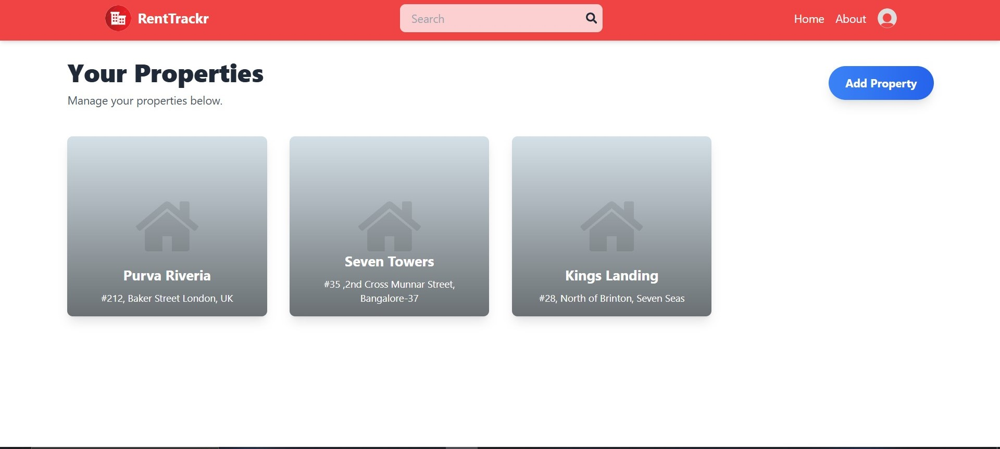
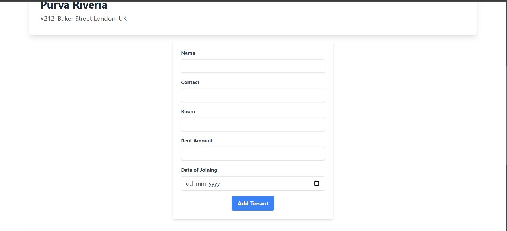
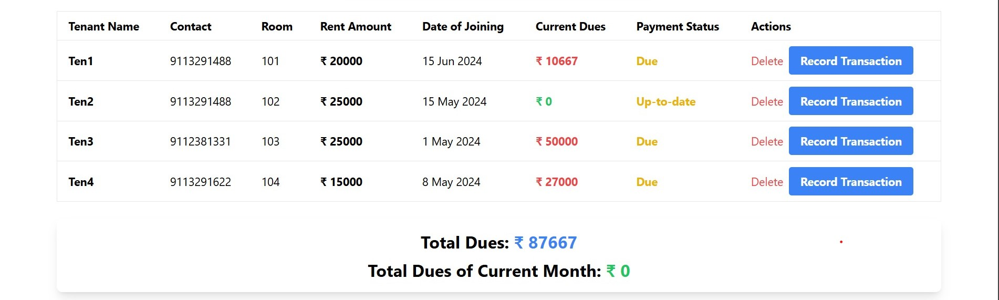
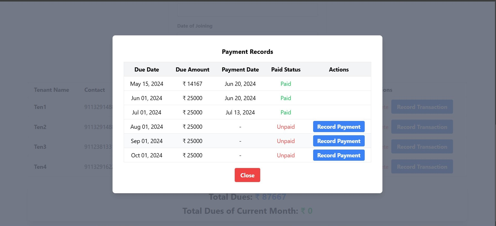

# RentTrackr

**Technologies:** MERN Stack, Tailwind CSS, Firebase  
**Live Demo:** [https://renttracker.onrender.com/](https://renttracker.onrender.com/)

**Description:**

RentTrackr is a property management web application developed using the MERN stack with Firebase integration for image storage. It allows property owners to efficiently manage their properties and tenants through an intuitive interface.

- **CRUD Operations:** Implemented create, read, update, and delete functionalities for properties and tenants, enhancing management efficiency and data handling.
- **Rent Tracking:** Enabled rent tracking for owners to record transactions and update payment statuses, simplifying financial management.
- **Landlord Interface:** Designed an intuitive interface for landlords to track tenant payment histories and manage rent collections effectively.

## Installation

To set up **RentTrackr** locally, follow these steps:

### 1. Clone the Repository

```bash
git clone https://github.com/Bambo0st/RentTracker.git
```

### 2. Navigate to the Project Directory

```bash
cd renttrackr
```
### 3. Install Dependencies

#### a. Server Dependencies

```bash
npm install
```
#### b. Client Dependencies

```bash
cd client
npm install
cd ..
```
### 4. Adding Environment Variables

#### a. Server `.env` File

Create a `.env` file in the `server` directory and add the following variables:

```env
MONGO_URL="<MONGO_URL>"
JWT_SECRET="<JWT_SECRET>"
```

#### b. Client `.env` File

```bash
cd client
```
Create a `.env` file in the `client` directory and add the following variable:
```env
VITE_FIREBASE_API_KEY="<VITE_FIREBASE_API_KEY>"
```
```bash 
cd ..
```
### 4. Run the application

#### a. Start the Server

```bash 
npm run dev
```
Open another terminal.
#### b. Start the Client
```bash
cd client
npm run dev
```
## Screenshots

### Home Page


### Add Tenant


### Rent Details


### Transaction History

